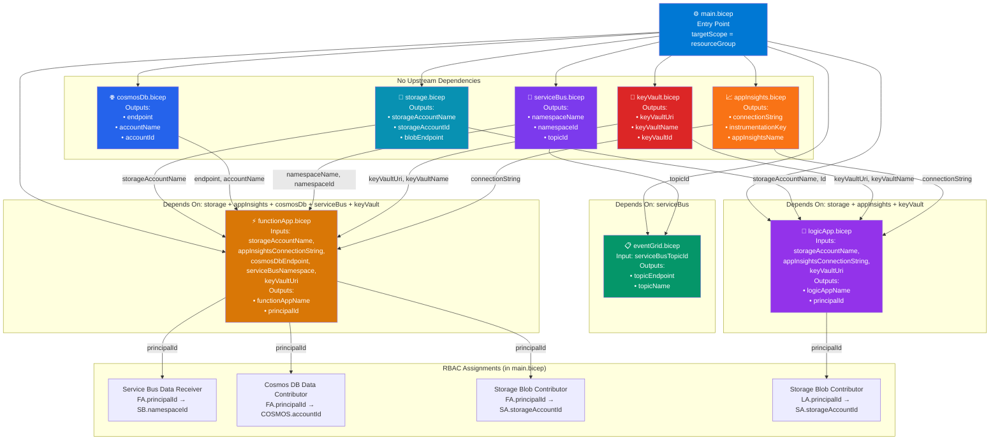

# Infrastructure as Code — Bicep

## OMS → D365 Integration · Azure Bicep IaC

This directory contains the complete Bicep Infrastructure as Code for the OMS-to-D365 Azure Integration project, structured for modularity, reusability, and multi-environment deployment.

---

## Folder Structure

```
infrastructure/bicep/
├── main.bicep                    ← Entry point — orchestrates all modules
├── modules/
│   ├── appInsights.bicep         ← Log Analytics Workspace + App Insights
│   ├── keyVault.bicep            ← Key Vault (RBAC model)
│   ├── serviceBus.bicep          ← Service Bus Namespace + Topic + Subscription + DLQ
│   ├── cosmosDb.bicep            ← Cosmos DB Account + Database + Container
│   ├── storage.bicep             ← Storage Account + Blob Container + Lifecycle Policy
│   ├── eventGrid.bicep           ← Event Grid Custom Topic + Event Subscription
│   ├── functionApp.bicep         ← App Service Plan (Y1) + Function App + App Settings
│   └── logicApp.bicep            ← App Service Plan (WS1) + Logic App Standard
└── parameters/
    ├── dev.bicepparam            ← Development environment parameters
    ├── uat.bicepparam            ← UAT environment parameters
    └── prod.bicepparam           ← Production environment parameters
```

---

## Module Dependency Diagram

The following diagram shows how `main.bicep` orchestrates each module and how module outputs flow into dependent modules:



---

## Parameter File Comparison

| Parameter | dev | uat | prod |
|---|---|---|---|
| `environment` | `dev` | `uat` | `prod` |
| `location` | `westeurope` | `westeurope` | `westeurope` |
| Cosmos RU/s | 400 manual | 400 manual | 100–4000 autoscale |
| Service Bus ZoneRedundant | false | false | true |
| Cosmos ZoneRedundant | false | false | true |
| Logic App Workers | 1 | 1 | 2 (max 4) |
| Storage SKU | LRS | LRS | ZRS |
| Key Vault PurgeProtection | false | false | true |
| Public Network Access | Enabled | Enabled | Disabled (PE) |
| AI Sampling | 100% | 100% | 50% |
| Log Retention | 30 days | 30 days | 90 days |

---

## Deployment Instructions

### Prerequisites

```bash
# 1. Install Azure CLI
az --version  # requires 2.50+

# 2. Install Bicep CLI
az bicep install
az bicep version   # requires 0.23+

# 3. Login to Azure
az login
az account set --subscription "<subscription-id>"
```

### Deploy Development Environment

```bash
# Create resource group
az group create \
  --name rg-oms-d365-integration-dev \
  --location westeurope

# Validate (dry run — no resources created)
az deployment group what-if \
  --resource-group rg-oms-d365-integration-dev \
  --template-file main.bicep \
  --parameters @parameters/dev.bicepparam

# Deploy
az deployment group create \
  --resource-group rg-oms-d365-integration-dev \
  --template-file main.bicep \
  --parameters @parameters/dev.bicepparam \
  --name "oms-d365-deploy-$(date +%Y%m%d-%H%M%S)"
```

### Deploy UAT Environment

```bash
az group create \
  --name rg-oms-d365-integration-uat \
  --location westeurope

az deployment group create \
  --resource-group rg-oms-d365-integration-uat \
  --template-file main.bicep \
  --parameters @parameters/uat.bicepparam
```

### Deploy Production Environment

```bash
# ⚠️ Production deployment — requires manual approval gate in pipeline
az group create \
  --name rg-oms-d365-integration-prod \
  --location westeurope

# Run what-if FIRST — review all changes before applying
az deployment group what-if \
  --resource-group rg-oms-d365-integration-prod \
  --template-file main.bicep \
  --parameters @parameters/prod.bicepparam

# Deploy (only after what-if review and approval)
az deployment group create \
  --resource-group rg-oms-d365-integration-prod \
  --template-file main.bicep \
  --parameters @parameters/prod.bicepparam \
  --name "oms-d365-prod-$(date +%Y%m%d-%H%M%S)"
```

---

## Post-Deployment Steps

After Bicep deployment completes, these steps must be done manually or via CI/CD:

### 1. Populate Key Vault Secrets

```bash
# D365 connection details (obtain from D365 admin)
az keyvault secret set \
  --vault-name kv-oms-integration-prod \
  --name D365-Base-Url \
  --value "https://your-d365-instance.operations.dynamics.com"

az keyvault secret set \
  --vault-name kv-oms-integration-prod \
  --name D365-Tenant-Id \
  --value "<your-aad-tenant-id>"

az keyvault secret set \
  --vault-name kv-oms-integration-prod \
  --name D365-Client-Id \
  --value "<app-registration-client-id>"

az keyvault secret set \
  --vault-name kv-oms-integration-prod \
  --name D365-Client-Secret \
  --value "<app-registration-client-secret>"
```

### 2. Grant Key Vault Secrets User Role to Function App and Logic App

```bash
# Get Function App managed identity principal ID
FA_PRINCIPAL=$(az functionapp identity show \
  --name func-oms-integration-prod \
  --resource-group rg-oms-d365-integration-prod \
  --query principalId -o tsv)

# Grant Key Vault Secrets User role
az role assignment create \
  --role "Key Vault Secrets User" \
  --assignee $FA_PRINCIPAL \
  --scope /subscriptions/<sub-id>/resourceGroups/rg-oms-d365-integration-prod/providers/Microsoft.KeyVault/vaults/kv-oms-integration-prod
```

### 3. Deploy Function App Code

```bash
# From repository root
cd src/FunctionApp.OmsIntegration
dotnet publish -c Release -o ./publish
cd publish
zip -r function-app.zip .

az functionapp deployment source config-zip \
  --resource-group rg-oms-d365-integration-prod \
  --name func-oms-integration-prod \
  --src function-app.zip
```

### 4. Deploy Logic App Workflow

```bash
# Copy workflow.json to Logic App Standard
az logicapp deployment source config-zip \
  --resource-group rg-oms-d365-integration-prod \
  --name la-oms-d365-delivery-prod \
  --src logic-app.zip
```

---

## Resource Naming Convention

| Resource Type | Pattern | Example (prod) |
|---|---|---|
| Resource Group | `rg-{project}-{env}` | `rg-oms-d365-integration-prod` |
| Service Bus | `sb-oms-integration-{env}` | `sb-oms-integration-prod` |
| Cosmos DB | `cosmos-oms-integration-{env}` | `cosmos-oms-integration-prod` |
| Storage Account | `saomsintegration{env}` | `saomsintegrationprod` |
| Function App | `func-oms-integration-{env}` | `func-oms-integration-prod` |
| Logic App | `la-oms-d365-delivery-{env}` | `la-oms-d365-delivery-prod` |
| Key Vault | `kv-oms-integration-{env}` | `kv-oms-integration-prod` |
| App Insights | `appi-oms-integration-{env}` | `appi-oms-integration-prod` |
| Log Analytics | `law-oms-integration-{env}` | `law-oms-integration-prod` |
| Event Grid Topic | `egt-oms-events-{env}` | `egt-oms-events-prod` |
| ASP (Functions) | `asp-oms-integration-{env}` | `asp-oms-integration-prod` |
| ASP (Logic App) | `asp-la-oms-integration-{env}` | `asp-la-oms-integration-prod` |

---

## Bicep vs Terraform Comparison

| Feature | Bicep | Terraform |
|---|---|---|
| Language | DSL (ARM-native) | HCL (cloud-agnostic) |
| State Management | ARM (no separate state file) | `.tfstate` (remote backend required) |
| Azure Coverage | 100% ARM coverage, day-0 support | ~95% coverage, slight lag for new services |
| Learning Curve | Lower for Azure-only teams | Higher but transferable to other clouds |
| IDE Support | Excellent (VS Code Bicep extension) | Good (VS Code Terraform extension) |
| CI/CD Integration | `az deployment group create` | `terraform plan && terraform apply` |
| Multi-cloud | Azure only | AWS, GCP, Azure, 100+ providers |
| Modules | Bicep modules (local or registry) | Terraform modules (local or registry) |
| When to use | Azure-only, native ARM, simpler syntax | Multi-cloud or existing Terraform estate |

---

## CI/CD Pipeline (GitHub Actions)

```yaml
# .github/workflows/deploy-bicep.yml
name: Deploy Bicep IaC

on:
  push:
    branches: [main]
    paths: ['infrastructure/bicep/**']
  workflow_dispatch:
    inputs:
      environment:
        description: 'Target environment'
        required: true
        default: 'dev'
        type: choice
        options: [dev, uat, prod]

jobs:
  validate:
    runs-on: ubuntu-latest
    steps:
      - uses: actions/checkout@v4
      - uses: azure/login@v1
        with:
          creds: ${{ secrets.AZURE_CREDENTIALS }}
      - name: Bicep lint
        run: az bicep build --file infrastructure/bicep/main.bicep
      - name: What-if
        run: |
          az deployment group what-if \
            --resource-group rg-oms-d365-integration-${{ inputs.environment || 'dev' }} \
            --template-file infrastructure/bicep/main.bicep \
            --parameters @infrastructure/bicep/parameters/${{ inputs.environment || 'dev' }}.bicepparam

  deploy:
    needs: validate
    runs-on: ubuntu-latest
    environment: ${{ inputs.environment || 'dev' }}  # requires manual approval for prod
    steps:
      - uses: actions/checkout@v4
      - uses: azure/login@v1
        with:
          creds: ${{ secrets.AZURE_CREDENTIALS }}
      - name: Deploy
        run: |
          az deployment group create \
            --resource-group rg-oms-d365-integration-${{ inputs.environment || 'dev' }} \
            --template-file infrastructure/bicep/main.bicep \
            --parameters @infrastructure/bicep/parameters/${{ inputs.environment || 'dev' }}.bicepparam \
            --name "oms-d365-${{ github.sha }}"
```
